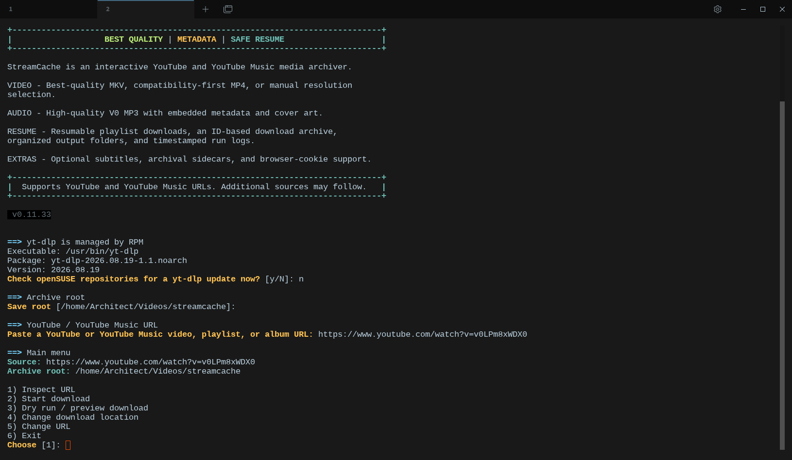

# StreamCache Bash Frontend v0.12.0

Interactive multi-source media archiver powered by [yt-dlp](https://github.com/yt-dlp/yt-dlp).

This folder contains the **Bash** frontend only (not the Python package).

## Contents

| File | Description |
|---|---|
| `streamcache` | Main interactive Bash script (v0.12.0) |
| `install.sh` | Optional installer (shell and/or Python package from a full repo checkout) |
| `README.md` | This file |

## Requirements

- **Bash** 4+
- **yt-dlp** on `PATH`
- **ffmpeg** (merge/remux/MP3/metadata)
- Optional: browser cookies for sites that bot-check / return HTTP 403

### openSUSE Tumbleweed

```fish
sudo zypper install ffmpeg yt-dlp
```

On other distros, install equivalent `ffmpeg` and `yt-dlp` packages.

## Quick install (shell script only)

```fish
mkdir -p ~/bin
cp streamcache ~/bin/streamcache
chmod +x ~/bin/streamcache
```

Ensure `~/bin` is on your `PATH`:

```fish
# fish
fish_add_path ~/bin

# bash
# echo 'export PATH="$HOME/bin:$PATH"' >> ~/.bashrc
```

Run:

```fish
streamcache
# or
~/bin/streamcache
```

## Installer script

`install.sh` can install the shell binary and add a **Start Menu / application launcher** entry.

From this folder:

```fish
chmod +x install.sh streamcache
./install.sh --mode shell --bin-dir ~/bin --force
```

That installs `~/bin/streamcache` and creates:

```text
~/.local/share/applications/streamcache.desktop
```

Menu-only helpers:

```fish
./install.sh --desktop-only      # add/update Start Menu entry
./install.sh --no-desktop        # install without menu entry
./install.sh --remove-desktop    # remove menu entry
```

Notes:

- Default shell install path is `~/bin/streamcache`
- Existing files are backed up as `streamcache.bak-YYYYMMDD-HHMMSS` when they differ
- On KDE/openSUSE the launcher opens StreamCache in **Konsole**; other desktops use a generic terminal (`Terminal=true`)
- `--mode python` / default `--mode all` expect a full repo checkout with `pyproject.toml` (not required for shell + desktop from this folder)

If you only want a manual copy without the menu entry, use **Quick install** above, then optionally run `./install.sh --desktop-only`.

## Usage

```fish
streamcache
```

The script is interactive:

1. Optional yt-dlp update check
2. Archive root (default: `~/Videos/streamcache`)
3. Media source URL (any yt-dlp-supported source)
4. Main menu:
   - Inspect URL
   - Start download
   - Dry run / preview
   - Change download location
   - Change URL
   - Exit

### Download modes

| Mode | Meaning |
|---|---|
| `1` | Best available video + audio, **MKV enforced** (default) |
| `2` | Best MP4-compatible video + audio when possible |
| `3` | Audio only → high-quality MP3 (V0) with cover art |
| `4` | Manual max height or exact yt-dlp format ID(s), MKV enforced |

### Optional extras

- English subtitles (video modes)
- Archival sidecars (info JSON, description, thumbnail)
- Browser cookies (Firefox, Chromium, Brave, etc.)

## Archive layout

Given archive root `~/Videos/streamcache`:

```text
~/Videos/streamcache/
  playlists/           # playlist / album items
  singles/             # standalone media
  logs/                # timestamped run logs
  archive/
    downloaded.txt     # yt-dlp download archive (skip already saved IDs)
  .streamcache-tmp/    # temporary / staging files
```

## Tips

**HTTP 403 / bot checks**

Use browser cookies from the authentication prompt, e.g. Firefox.

**Safe resume**

Interrupted downloads can be retried. Completed items recorded in `archive/downloaded.txt` are skipped.

**Debug yt-dlp arguments**

```fish
set -x STREAMCACHE_DEBUG 1
streamcache
```

## Version

- StreamCache Bash frontend: **0.12.0**
- Neutral multi-source branding (not locked to a single site)
- Banner tagline: multi-source media archiver

## Related

Python package / full project:

https://github.com/pixel9-lab/streamcache-python

```fish
pipx install "git+https://github.com/pixel9-lab/streamcache-python.git"
# or from a clone:
./scripts/install.sh
```

## License

MIT (same as the StreamCache project).
