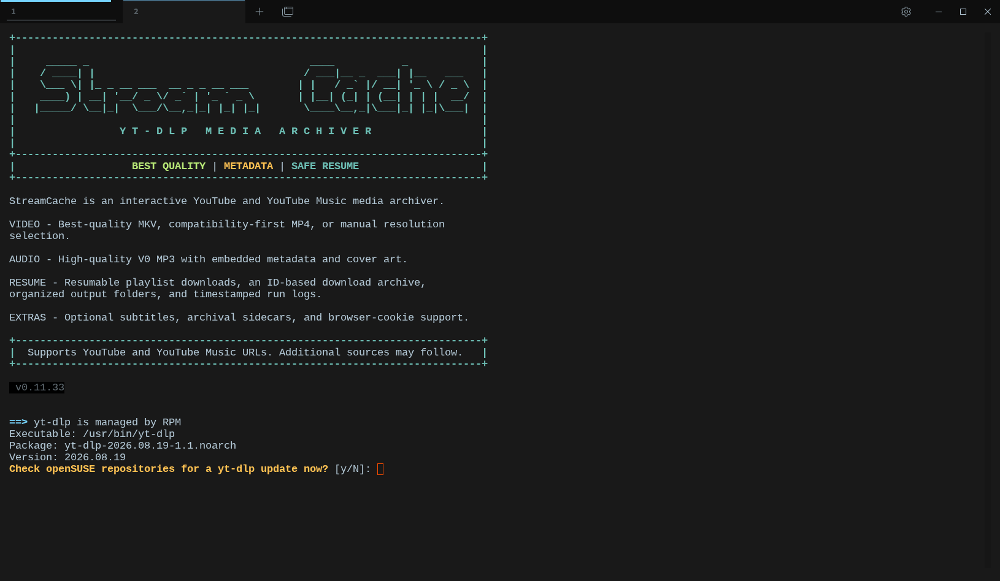

# StreamCache

StreamCache is an interactive Bash front end for [yt-dlp](https://github.com/yt-dlp/yt-dlp) that archives YouTube and YouTube Music media with sensible defaults, resumable playlist support, optional metadata, and simple terminal prompts.

## Features

- Best available video and audio, merged to MKV by default
- MP4-compatible download mode
- Audio-only MP3 conversion with embedded cover art
- Playlist support with organized output folders
- Resume-safe downloads using yt-dlp's download archive
- Optional subtitles, metadata sidecars, thumbnails, and browser cookies
- Dry-run preview mode and terminal progress display
- Optional yt-dlp update check for openSUSE/RPM installations

## Requirements

- Linux system with Bash 4+
- `yt-dlp`
- `ffmpeg`
- `python3` is recommended for yt-dlp installations and optional tooling
- `sudo` and `zypper` are only needed if you choose StreamCache's automatic dependency-install/update options on openSUSE

On openSUSE Tumbleweed:

```bash
sudo zypper install yt-dlp ffmpeg
```

## Install

Place the script somewhere on your `PATH`, then make it executable:

```bash
mkdir -p "$HOME/bin"
cp streamcache-v0.11.32.bash "$HOME/bin/streamcache"
chmod +x "$HOME/bin/streamcache"
```

Ensure `$HOME/bin` is on your shell `PATH`, then launch it with:

```bash
streamcache
```

## Usage

1. Start `streamcache`.
2. Select an archive location; the default is `~/Videos/streamcache`.
3. Paste a YouTube or YouTube Music video, playlist, album, or supported URL.
4. Use the menu to inspect the source, preview a dry run, or start a download.
5. Choose video, MP4-compatible video, audio-only MP3, or manual format selection.

Downloads are organized below the archive root:

```text
~/Videos/streamcache/
├── playlists/
├── singles/
├── archive/downloaded.txt
├── logs/
└── .streamcache-tmp/
```

The download archive prevents previously completed media from downloading again. Keep `archive/downloaded.txt` if you want resume-safe behavior across future runs.

## Cookies and private content

For public media, choose `n` at the browser-cookie prompt unless YouTube returns a 403, bot-check, or sign-in requirement.

For private, age-restricted, members-only, or otherwise account-gated media, choose a browser profile where you are signed in to an account that already has permission. Browser cookies authenticate yt-dlp; they do not bypass access restrictions. A private playlist cannot be downloaded unless the selected account is authorized to view it.

## Impersonation warning

You may see a warning such as:

```text
The extractor specified to use impersonation for this download,
but no impersonate target is available.
```

This is usually harmless when the download succeeds. If downloads fail with bot checks or similar errors, install a yt-dlp build with `curl-cffi` support and verify available targets:

```bash
yt-dlp --list-impersonate-targets
```

## Notes

- Follow YouTube's terms of service and applicable copyright law.
- Download only media you are allowed to access and archive.
- Start with **Dry run / preview download** when testing a new URL or format choice.
